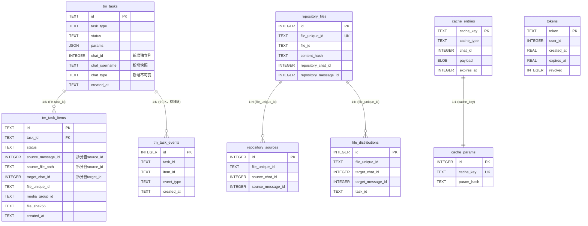

# 数据模型设计文档

> **版本**: v1.1
> **更新日期**: 2026-07-19
> **状态**: 基线文档，记录 SQLModel 全量迁移 + 相册模式修复后的模型现状

---

## 1. 概述

### 1.1 双层架构

项目采用 **业务层 dataclass + 数据库层 SQLModel Record** 的双层架构：

| 层级 | 类型 | 用途 | 文件位置 |
|------|------|------|---------|
| 业务层 | `Task` / `TaskItem` dataclass | 内存中使用，携带业务逻辑 | `module/core/task_manager.py` |
| 数据库层 | `TaskRecord` / `TaskItemRecord` SQLModel | 持久化，ORM 映射 | `module/core/models/task.py` |
| 转换层 | `_task_to_record` / `_record_to_task` mapper | 双向转换 | `module/core/task_manager.py` |

### 1.2 数据库文件

所有表合并到单一数据库文件 `trmd.db`，由 `module/core/db.py` 统一管理异步+同步引擎。

### 1.3 命名规范

- 数据库层模型类名加 `Record` 后缀，避免与业务层 dataclass 冲突
- 表名使用 `snake_case`（如 `tm_tasks`、`repository_files`）
- 枚举值使用 `snake_case` 字符串存储（如 `"pending"`、`"download"`)

### 1.4 兼容性策略

> **开发阶段决策**：不考虑数据兼容性，无需编写迁移脚本。

- 直接修改 `CREATE TABLE` 语句，旧数据库需删除重建
- 字段移除/类型变更/重命名均直接执行，不做数据迁移
- 待生产部署后再考虑迁移框架（如 Alembic）

---

## 2. 表关系图（ER 图）



**说明**：
- `tm_task_events` 标注"待移除"：业务代码完全未使用（详见 §6.10）
- `tm_tasks` 与 `repository_files` 之间无直接外键关联，通过 `file_distributions.task_id` 间接关联
- `tokens` 表完全独立

---

## 3. Telegram API 类型映射规范

> **核心原则**：项目中的标识符类型以 Telegram 官方 API 返回类型为准，
> 避免业务层与数据库层之间不必要的类型转换。

### 3.1 TG API 标识符类型

| TG API 属性 | Pyrogram 类型 | 示例值 | 可变性 | 说明 |
|-------------|--------------|--------|--------|------|
| `chat.id` | `int` | `-1001234567890` | **不可变** | 频道/超级群为负数，私聊为正数 |
| `message.id` | `int` | `96414` | **不可变**（频道内单调递增） | 范围内唯一，不同频道可重复 |
| `media_group_id` | `str` | `"12345678901234567"` | **不可变** | 字符串型整数，长度超出 JS 安全整数 |
| `chat.username` | `Optional[str]` | `"miaotuya"` | ⚠️ **可变** | 管理员可修改；私聊/Bot 也可改 |
| `chat.title` | `Optional[str]` | `"频道名称"` | ⚠️ **可变** | 频道/群组管理员可随时修改 |
| `user.first_name` | `Optional[str]` | `"张三"` | ⚠️ **可变** | 用户可随时修改 |
| `file_unique_id` | `str` | `"AQADNTEx"` | **不可变** | 同一文件的唯一标识（跨 Bot 通用） |
| `file_id` | `str` | `"BAACBC..."` | **可变** | 每次获取可能不同，不可做持久标识 |

### 3.2 项目中应遵循的类型规则

| 字段 | TG API 类型 | 项目业务层类型 | 数据库层类型 | 转换规则 |
|------|------------|--------------|------------|---------|
| `chat_id` | `int` | `int` | `INTEGER` | 无转换 |
| `message_id` | `int` | `int` | `INTEGER` | 无转换 |
| `media_group_id` | `str` | `Optional[str]` | `TEXT` | 无转换 |
| `source_chat_id` | `int` | `int` | `INTEGER` | 无转换 |
| `target_chat_id` | `int` | `int` | `INTEGER` | 无转换 |
| `file_unique_id` | `str` | `Optional[str]` | `TEXT` | 无转换 |
| `username` | `Optional[str]` | `Optional[str]` | `TEXT` | 无转换 |

**禁止**：`int` → `str` → `int` 的往返转换（如当前 `source_id` 的模式）。

### 3.3 username 的可变性与保存策略

`username` 虽然可变，但具备以下特征使其值得保存：

1. **变更频率远低于 title**：频道改名是常见运营行为，改 username 则意味着旧链接失效，代价较高
2. **可追溯性**：即使频道改了 username，保存的是任务创建时的值，仍可辅助识别
3. **私聊/Bot 场景**：私聊无 username（为 `None`），但 Bot 的 username（如 `@xxx_bot`）相对稳定
4. **前端展示**：有 username 时可构造 `t.me/{username}` 链接，提升任务列表可读性

**保存原则**：作为任务创建时刻的**快照**保存，不保证与当前 TG 实时一致。如果 username 为 `None`（私聊），则不保存。

---

## 4. 表模型详细定义

### 4.1 tm_tasks（任务主表）

| 列名 | 类型 | 约束 | 默认值 | 索引 | 备注 |
|------|------|------|--------|------|------|
| `id` | TEXT | PK | — | — | 任务 ID（如 `task_xxx`） |
| `task_type` | TEXT | NOT NULL | — | — | 枚举：download/forward/upload/listen_download/listen_forward |
| `status` | TEXT | NOT NULL | — | ✅ | 枚举：pending/queued/running/completed/failed/cancelled |
| `chat_id` | INTEGER | NOT NULL | — | ✅ | **新增独立列**：从 params JSON 提升（详见 §6.1） |
| `chat_username` | TEXT | — | None | — | **新增快照**：频道 username（详见 §6.2） |
| `chat_type` | TEXT | — | None | — | **新增不可变**：channel/private/bot 等 |
| `params` | JSON | — | `{}` | — | 任务参数（移除 chat_id 注入） |
| `created_at` | TEXT | NOT NULL | — | ✅ | ISO 格式时间戳（长期统一为 datetime，§6.4） |
| `started_at` | TEXT | — | None | — | |
| `completed_at` | TEXT | — | None | — | |
| `total_size_bytes` | INTEGER | — | 0 | — | |
| `error_message` | TEXT | — | None | — | |
| `retry_count` | INTEGER | — | 0 | — | |
| `max_retry_count` | INTEGER | — | 5 | — | |
| `extra` | JSON | — | `{}` | — | 扩展字段 |

**已移除字段**（详见 §6.7）：
- ~~`total_items`~~ / ~~`success_items`~~ / ~~`failed_items`~~ / ~~`skipped_items`~~ — 改为实时动态计算，避免双重写入

### 4.2 tm_task_items（子任务表）

| 列名 | 类型 | 约束 | 默认值 | 索引 | 备注 |
|------|------|------|--------|------|------|
| `id` | TEXT | PK | — | — | 如 `task_xxx_msg_96414` |
| `task_id` | TEXT | FK→tm_tasks.id | — | ✅ | |
| `status` | TEXT | — | "pending" | ✅ | 枚举：pending/running/success/failed/skipped/cancelled |
| `source_message_id` | INTEGER | — | None | — | **拆分自 source_id**：TG 消息 ID（详见 §6.3） |
| `source_file_path` | TEXT | — | None | — | **拆分自 source_id**：本地文件路径（仅上传任务） |
| `target_chat_id` | INTEGER | — | None | — | **拆分自 target_id**：目标频道 ID |
| `file_path` | TEXT | — | None | — | 可移植相对路径 |
| `file_size` | INTEGER | — | 0 | — | |
| `file_sha256` | TEXT | — | None | ✅ | 内容哈希 |
| `telegram_file_id` | TEXT | — | None | — | TG file_id（可变，不可做持久标识） |
| `file_unique_id` | TEXT | — | None | ✅ | TG file_unique_id（不可变） |
| `uploaded_message_id` | INTEGER | — | None | — | 上传到仓库频道后的消息 ID |
| `retry_count` | INTEGER | — | 0 | — | |
| `error_code` | TEXT | — | None | — | 机器可读错误码 |
| `error_message` | TEXT | — | None | — | 人类可读错误信息 |
| `created_at` | TEXT | NOT NULL | — | — | |
| `updated_at` | TEXT | NOT NULL | — | — | |
| `extra` | JSON | — | `{}` | — | |
| `media_group_id` | TEXT | — | None | ✅ | 相册分组标识（2026-07-18 新增） |

**已移除字段**：
- ~~`source_id`~~ — 拆分为 `source_message_id` + `source_file_path`（详见 §6.3）
- ~~`target_id`~~ — 拆分为 `target_chat_id`（详见 §6.3）
- ~~`source_link`~~ — **所有业务代码赋值均为 None**，从未被实际使用（详见 §6.9）
- ~~`last_progress_bytes`~~ — 从未被读取，仅内存中维护（详见 §6.6）

### 4.3 tm_task_events（任务事件表）⚠️ 待移除

| 列名 | 类型 | 约束 | 默认值 | 索引 | 备注 |
|------|------|------|--------|------|------|
| `id` | INTEGER | PK (auto) | — | — | 自增主键 |
| `task_id` | TEXT | — | — | ✅ | 关联任务（无 FK 约束） |
| `item_id` | TEXT | — | None | — | 关联子任务（可选） |
| `event_type` | TEXT | NOT NULL | — | — | |
| `message` | TEXT | — | None | — | |
| `payload` | TEXT | — | None | — | |
| `created_at` | TEXT | NOT NULL | — | — | |

**⚠️ 用途评估结论**（详见 §6.10）：

调研发现该表**完全未被业务代码使用**：
- 仅有 SQLModel 模型定义（`module/core/models/task.py:65`）和单元测试引用
- 没有任何 `TaskEventRecord(...)` 实例化代码（业务层）
- 没有任何 `session.add(TaskEventRecord(...))` 调用
- 没有 API 端点暴露事件查询

**设计初衷**：作为任务状态变更的审计日志（如 pending→running→completed 的完整轨迹），与 `TaskItemRecord.status`（仅存最终状态）互补。

**当前结论**：设计已废弃，待移除。如未来需要审计能力，应基于实际需求重新设计（如增加 `task_status_history` 表，记录每次状态变更的时间戳、触发者、上下文）。

### 4.4 repository_files（仓库文件表）

| 列名 | 类型 | 约束 | 默认值 | 索引 | 备注 |
|------|------|------|--------|------|------|
| `id` | INTEGER | PK (auto) | — | — | |
| `file_unique_id` | TEXT | UNIQUE, NOT NULL | — | ✅ | 全局唯一文件标识 |
| `file_id` | TEXT | NOT NULL | — | ✅ | TG file_id（可变） |
| `content_hash` | TEXT | — | None | ✅ | SHA256 内容哈希 |
| `file_size` | INTEGER | NOT NULL | — | — | |
| `file_type` | TEXT | NOT NULL | — | — | "video"/"photo"/"document" 等 |
| `mime_type` | TEXT | — | None | — | |
| `file_name` | TEXT | — | None | — | |
| `repository_chat_id` | INTEGER | NOT NULL | — | — | 仓库频道 ID |
| `repository_message_id` | INTEGER | NOT NULL | — | — | 仓库频道中的消息 ID |
| `created_at` | TEXT | — | None | — | |
| `updated_at` | TEXT | — | None | — | |
| `status` | TEXT | — | "active" | — | |

### 4.5 repository_sources（文件来源映射表）

| 列名 | 类型 | 约束 | 默认值 | 索引 | 备注 |
|------|------|------|--------|------|------|
| `id` | INTEGER | PK (auto) | — | — | |
| `file_unique_id` | TEXT | — | — | ✅ | 关联仓库文件 |
| `source_chat_id` | INTEGER | NOT NULL | — | — | 来源频道 ID |
| `source_message_id` | INTEGER | NOT NULL | — | — | 来源消息 ID |
| `created_at` | TEXT | — | None | — | |

**已移除字段**：
- ~~`source_link`~~ — 从未被实际赋值（详见 §6.9）

**唯一约束**：`UNIQUE(source_chat_id, source_message_id)`

**说明**：来源链接可通过 `source_chat_id` + `source_message_id` 动态构造（如 `t.me/{username}/{message_id}`），无需冗余存储。

### 4.6 file_distributions（文件分发记录表）

| 列名 | 类型 | 约束 | 默认值 | 索引 | 备注 |
|------|------|------|--------|------|------|
| `id` | INTEGER | PK (auto) | — | — | |
| `file_unique_id` | TEXT | — | — | ✅ | |
| `target_chat_id` | INTEGER | NOT NULL | — | — | |
| `target_message_id` | INTEGER | — | None | — | |
| `method` | TEXT | NOT NULL | — | — | 分发方式 |
| `task_id` | TEXT | — | None | ✅ | 关联任务 |
| `created_at` | TEXT | — | None | — | |

### 4.7 cache_entries / cache_params（缓存表）

**cache_entries**：

| 列名 | 类型 | 约束 | 默认值 | 索引 | 备注 |
|------|------|------|--------|------|------|
| `cache_key` | TEXT | PK | — | — | |
| `cache_type` | TEXT | NOT NULL | — | — | |
| `chat_id` | INTEGER | — | None | ✅ | **类型统一**：从 TEXT 改为 INTEGER（§6.4） |
| `payload` | BLOB | NOT NULL | — | — | 二进制数据 |
| `expires_at` | INTEGER | NOT NULL | — | — | Unix 时间戳 |
| `created_at` | INTEGER | NOT NULL | — | — | Unix 时间戳 |
| `updated_at` | INTEGER | NOT NULL | — | — | Unix 时间戳 |
| `version` | INTEGER | — | 1 | — | |

**cache_params**：

| 列名 | 类型 | 约束 | 默认值 | 索引 | 备注 |
|------|------|------|--------|------|------|
| `id` | INTEGER | PK (auto) | — | — | |
| `cache_key` | TEXT | UNIQUE, NOT NULL | — | — | |
| `param_hash` | TEXT | NOT NULL | — | ✅ | |
| `param_json` | TEXT | NOT NULL | — | — | |

### 4.8 tokens（认证令牌表）

| 列名 | 类型 | 约束 | 默认值 | 索引 | 备注 |
|------|------|------|--------|------|------|
| `token` | TEXT | PK | — | — | |
| `user_id` | INTEGER | NOT NULL | 0 | — | |
| `created_at` | REAL | NOT NULL | — | ✅ | Unix 时间戳（float） |
| `expires_at` | REAL | NOT NULL | — | ✅ | Unix 时间戳（float） |
| `last_used_at` | REAL | — | None | — | |
| `revoked` | INTEGER | NOT NULL | 0 | — | **移除索引**：查询频率低（详见 §6.8） |
| `usage_count` | INTEGER | NOT NULL | 0 | — | |

**清理策略**（详见 §6.8）：
- 已有 `cleanup_expired` 方法执行**硬删除**（`token_manager.py:309`）
- `revoked` 字段保留用于主动撤销场景（用户登出、管理员撤销），不立即删除
- 定期硬删除已过期 + 已撤销的 token，避免表膨胀

---

## 5. 业务层 dataclass 与数据库 Record 映射

### 5.1 类型转换规则表

| 业务层字段 | 业务层类型 | 数据库层字段 | 数据库层类型 | 转换逻辑 | 问题 |
|-----------|-----------|------------|------------|---------|------|
| `task.chat_id` | `int` | `chat_id` | `INTEGER` | 直传 | ✅ 修复后正常 |
| `item.source_message_id` | `Optional[int]` | `source_message_id` | `INTEGER` | 直传 | ✅ 修复后正常 |
| `item.source_file_path` | `Optional[str]` | `source_file_path` | `TEXT` | 直传 | ✅ 修复后正常 |
| `item.target_chat_id` | `Optional[int]` | `target_chat_id` | `INTEGER` | 直传 | ✅ 修复后正常 |
| `item.status` | `ItemStatus` 枚举 | `status` | `TEXT` | `.value` / `ItemStatus(val)` | ✅ 正常 |
| `task.task_type` | `TaskType` 枚举 | `task_type` | `TEXT` | `.value` / `TaskType(val)` | ✅ 正常 |
| `item.media_group_id` | `Optional[str]` | `media_group_id` | `TEXT` | 直传 | ✅ 正常 |
| `item.file_unique_id` | `Optional[str]` | `file_unique_id` | `TEXT` | 直传 | ✅ 正常 |

### 5.2 添加新字段的修改 checklist

每次添加新字段需同步修改以下位置：

| 序号 | 文件 | 修改内容 |
|------|------|---------|
| 1 | `module/core/models/task.py` | Record 模型添加字段 |
| 2 | `module/core/task_manager.py` | TaskItem dataclass 添加字段 |
| 3 | `module/core/task_manager.py` | `_item_to_record()` mapper 添加映射 |
| 4 | `module/core/task_manager.py` | `_record_to_item()` mapper 添加映射 |
| 5 | 业务逻辑代码 | 赋值/读取新字段 |

> ⚠️ 当前 mapper 完全手写，遗漏任一处即导致数据丢失。长期应考虑基于反射的自动 mapper 生成。

---

## 6. 已知问题与改进计划

### 6.1 🔴 P0：chat_id 提升为独立列

**现状**：`chat_id` 存储在 `params` JSON 中，`_task_to_record()` 时隐式注入 `task.params["chat_id"]`。

**调研结论**：
- 当前**没有**"按频道查询所有任务"的场景（`list_tasks` / `get_tasks` 均不按 chat_id 过滤）
- 但 `chat_id` 是任务创建时的必填字段，已存在于业务层
- 隐式注入 `task.params["chat_id"]` 是真实副作用，外部代码在 mapper 调用前后会看到不同的 params 内容

**评估结论**：**应提升为独立列**，理由：
1. 消除隐式副作用（即使没有查询需求，也应避免 mapper 修改业务对象）
2. 未来"按频道查询任务"是合理需求（任务管理页面按频道分组展示）
3. 索引成本极低（每任务一个 int 值），收益明确

**计划**：`TaskRecord` 添加 `chat_id: int = Field(index=True)` 独立列，移除 mapper 中的隐式注入。

### 6.2 🔴 P0：新增可读标识字段

**现状**：任务列表仅显示 `chat_id`（如 `-1001234567890`），用户无法识别对应频道/用户。

**计划**：`TaskRecord` 新增以下字段：

| 字段 | 类型 | 来源 | 备注 |
|------|------|------|------|
| `chat_username` | `Optional[str]` | `ResolvedChat.username` | 可为 None（私聊无 username） |
| `chat_type` | `Optional[str]` | `ResolvedChat.chat_type` | "channel"/"private"/"bot" 等 |

**说明**：
- 不保存 `chat_name`（title/first_name）— 这些是可变的，保存后即为快照，可能很快过时
- `chat_username` 也是可变的，但变更代价远高于 title（改 username 会导致 `t.me/xxx` 旧链接失效）
- `chat_type` 不可变，标识对话类型
- 前端可由 `chat_username` 构造 `t.me/{username}` 链接
- 私聊/Bot 场景中 `chat_username` 可能为 None（Bot 有 username，纯私聊无 username）

### 6.3 🔴 P0：source_id / target_id 类型统一

**现状**：`source_id` 在业务层为 `Union[int, str]`，承载两种语义：
- 下载/转发任务：Telegram 消息 ID（`int`）
- 上传任务（本地文件）：文件路径（`str`）

`target_id` 始终是 Telegram 聊天 ID（`int`），但类型声明为 `Union[int, str]`。

**问题**：
- 数据库存为 `TEXT`，读回时 `_parse_source_id()` 尝试 `int()` 转换 — 同一条记录写后再读类型可能变化
- `target_id` 读回时直接 `int()`，如果值不是数字会 `ValueError`

**计划**：拆分为语义明确的字段：

| 现有字段 | 拆分为 | 类型 | 说明 |
|---------|-------|------|------|
| `source_id: Union[int, str]` | `source_message_id` | `Optional[int]` | TG 消息 ID |
| | `source_file_path` | `Optional[str]` | 本地文件路径（仅上传任务） |
| `target_id: Union[int, str]` | `target_chat_id` | `Optional[int]` | 目标频道 ID |

**兼容性**：开发阶段不考虑兼容性，直接修改 schema（§1.4）。

### 6.4 🟡 P1：时间字段类型统一为 datetime

**现状**：三种时间格式并存：

| 表 | 字段 | 类型 | 格式 |
|----|------|------|------|
| tm_tasks / tm_task_items / repository_files | created_at | TEXT | ISO 8601 字符串 |
| cache_entries | created_at | INTEGER | Unix 时间戳（秒） |
| tokens | created_at | REAL | Unix 时间戳（秒，含小数） |

**计划**：长期统一为 `datetime` 类型。
- SQLModel / SQLAlchemy 原生支持 `datetime` 类型
- 利用数据库时间函数（范围查询、排序、时区处理）
- 统一时间生成入口（`default_factory=datetime.utcnow`）
- `cache_entries.chat_id` 字段类型从 TEXT 改为 INTEGER，与其他表保持一致

### 6.5 🟡 P1：Task.items 泛型注解

**现状**：`items: list = field(default_factory=list)`

**计划**：改为 `items: list[TaskItem] = field(default_factory=list)`

### 6.6 🟡 P2：last_progress_bytes 仅内存维护

**现状**：下载过程中持续更新该字段（写入数据库），但**从未被读取使用**。

**调研结论**：
- 全代码库无读取 `last_progress_bytes` 的业务逻辑
- 仅在 `_on_item_progress` 中通过 `update_item_status(last_progress_bytes=xxx)` 写入

**计划**：
- **移除数据库持久化**：从 `TaskItemRecord` 删除该列
- **保留内存中的临时变量**：在 `TaskItem` dataclass 中保留（或改为局部变量），仅用于进度回调
- 如未来需要断点续传，重新设计（如独立的 `download_progress` 内存对象）

### 6.7 🟡 P2：冗余汇总字段移除持久化

**现状**：`TaskRecord` 中 `total_items`/`success_items`/`failed_items`/`skipped_items` 可从 `TaskItemRecord` 实时计算，每次子任务状态变更都需**双重写入**（更新 item + 更新 task 汇总）。

**评估结论**：
- 双重写入带来数据一致性风险（更新中断会导致汇总与实际 items 不一致）
- 任务列表分页查询的 N+1 问题可通过 **JOIN + 聚合查询** 解决，不一定需要冗余字段
- 开发阶段无历史数据兼容负担

**计划**：
- **移除 4 个冗余汇总字段** 的数据库持久化
- 任务列表查询改为 JOIN 聚合：

```sql
SELECT t.*, 
       COUNT(i.id) AS total_items,
       SUM(CASE WHEN i.status='success' THEN 1 ELSE 0 END) AS success_items,
       SUM(CASE WHEN i.status='failed' THEN 1 ELSE 0 END) AS failed_items
FROM tm_tasks t
LEFT JOIN tm_task_items i ON i.task_id = t.id
GROUP BY t.id
LIMIT ? OFFSET ?
```

- `Task` dataclass 的 `total_items`/`success_count` 等属性保留为内存计算（已有 `success_count` property 实现）

### 6.8 🟡 P2：tokens 表清理策略

**现状**：
- 已有 `cleanup_expired(max_age_hours=24)` 方法执行硬删除（`token_manager.py:309`）
- `revoked` 字段被业务逻辑使用：撤销活跃 token（用户登出、管理员撤销），不立即删除
- `revoked` 字段有索引，但查询频率低

**评估结论**：
- **保留 `revoked` 字段**：主动撤销场景需要（撤销后 token 立即失效，但记录保留用于审计）
- **移除 `revoked` 索引**：查询频率低，索引收益有限
- **定期硬删除**：已过期 + 已撤销超过 24 小时的 token 应硬删除（已有实现）
- **不建议立即硬删除撤销的 token**：需要保留撤销记录用于排查"谁在何时撤销了哪个 token"

### 6.9 🔴 P0：移除 source_link 字段

**调研结论**：
- **所有业务代码赋值均为 None**：
  - `module/downloader.py:1863` — `source_link=None`
  - `module/downloader.py:1911` — `source_link=None`
  - `module/core/repository_manager.py:199` — `source_link=None`
- 仅在 mapper 中传递（`task_manager.py:385/410`, `repository_db.py:168/179`），从未被业务逻辑读取
- 从未在 API 响应中暴露

**计划**：
- 从 `tm_task_items` 表移除 `source_link` 列
- 从 `repository_sources` 表移除 `source_link` 列
- 移除 `TaskItem` dataclass 的 `source_link` 字段
- 移除 mapper 中的 `source_link` 映射
- 如需消息链接，可由 `chat_username` + `message_id` 动态构造

### 6.10 🔴 P0：移除 tm_task_events 表

**调研结论**：
- **业务代码完全未使用**：
  - 仅有 SQLModel 模型定义（`module/core/models/task.py:65`）
  - 仅有单元测试引用（`tests/unit/test_sqlmodel_task.py`）
  - **没有任何 `TaskEventRecord(...)` 实例化代码**（业务层）
  - **没有任何 `session.add(TaskEventRecord(...))` 调用**
  - 没有任何 API 端点暴露事件查询
- 该表始终为空，从未写入任何数据

**设计初衷（推测）**：作为任务状态变更的审计日志，记录 pending→running→completed 的完整轨迹。但实际未实现写入逻辑。

**计划**：
- **移除 `tm_task_events` 表**
- 移除 `TaskEventRecord` 模型定义
- 移除 `__init__.py` 中的导出
- 移除相关单元测试
- 如未来需要审计能力，基于实际需求重新设计（如 `task_status_history` 表）

---

## 7. 变更记录

| 日期 | 变更内容 | 涉及文件 |
|------|---------|---------|
| 2026-07-18 | SQLModel 全量迁移：所有表合并到 trmd.db，Record 模型替代原生 SQL | `models/*.py`, `db.py`, `task_manager.py`, `repository_db.py`, `cache_manager.py`, `token_manager.py` |
| 2026-07-18 | 相册模式修复：TaskItem 新增 `media_group_id` 字段，分组逻辑改为按 media_group_id 分组 | `models/task.py`, `task_manager.py`, `task_executor.py`, `downloader.py`, `repository_manager.py` |
| 2026-07-18 | 基线文档创建（v1.0） | 本文档 |
| 2026-07-19 | 文档修订（v1.1）：基于字段使用调研更新改进计划 | 本文档 |

### v1.1 主要修订

1. **§1.4 兼容性策略**：明确开发阶段不考虑兼容性，无需迁移脚本
2. **§2 ER 图**：ASCII 关系图改为 Mermaid erDiagram
3. **§4.1 tm_tasks**：新增 `chat_id`/`chat_username`/`chat_type` 列；移除 4 个冗余汇总字段
4. **§4.2 tm_task_items**：`source_id` 拆分为 `source_message_id` + `source_file_path`；`target_id` 拆分为 `target_chat_id`；移除 `source_link` 和 `last_progress_bytes`
5. **§4.3 tm_task_events**：标注"待移除"，补充用途评估结论
6. **§4.5 repository_sources**：移除 `source_link` 字段
7. **§4.7 cache_entries**：`chat_id` 类型从 TEXT 改为 INTEGER
8. **§4.8 tokens**：移除 `revoked` 索引，明确清理策略
9. **§6.1 chat_id**：补充调研结论，确认提升为独立列
10. **§6.6 last_progress_bytes**：从"评估"改为"移除持久化，仅内存维护"
11. **§6.7 冗余汇总字段**：从"添加一致性校验"改为"移除持久化，实时计算"
12. **§6.8 tokens 清理**：新增章节
13. **§6.9 source_link 移除**：新增章节
14. **§6.10 tm_task_events 移除**：新增章节
