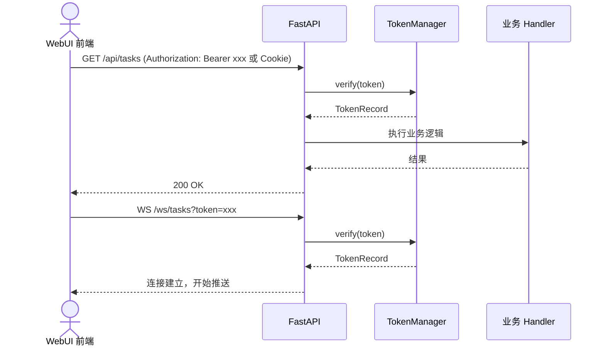

# Telegram_Restricted_Media_Downloader 模块设计文档 — Token 认证子系统

> **文档名称**: 模块设计-Token认证
> **所属项目**: Telegram_Restricted_Media_Downloader  
> **关联文档**: [交互增强设计.md](./交互增强设计.md)  
> **版本**: v1.0  
> **创建日期**: 2026-06-18  
> **作者**: AI Assistant  
> **状态**: 草案  

---

## 1. 设计目标与职责边界

### 1.1 设计目标

Token 认证子系统为 **Bot + WebUI 双端架构** 提供一条安全、无状态的临时认证通道：

1. **无感登录**：用户通过 Bot `/web` 命令获取带 Token 的访问链接，点击后直接进入 WebUI，无需输入账号密码。
2. **全端点保护**：所有 REST API 与 WebSocket 端点必须校验 Token，未携带或携带无效 Token 的请求一律拒绝。
3. **单用户定位**：当前版本仅服务 `filters.user(self.root)` 通过后的唯一用户，不做多用户隔离。
4. **向后兼容**：新增 `/web`、`/web_revoke` 命令，不改动现有 Bot 命令的行为与路由。
5. **可撤销、可续期**：支持 Token 撤销、全量撤销与刷新续期，降低 Token 泄露后的风险窗口。

### 1.2 职责边界

| 组件 | 负责 | 不负责 |
|------|------|--------|
| **TokenManager** | Token 的生成、验证、刷新、撤销、过期清理与持久化 | 用户身份鉴别、Bot 命令处理、业务逻辑 |
| **FastAPI 认证层** | 从 URL / Header / Cookie 提取 Token，调用 TokenManager 校验，注入请求上下文 | 直接操作用户会话、鉴权策略变更 |
| **Bot 端 `/web` 命令** | 在 `filters.user(self.root)` 通过后生成 Token 并组装访问链接 | Token 校验、API 鉴权 |
| **WebUI 前端** | 首次访问携带 URL Token，后续请求携带 Authorization Header 或 HttpOnly Cookie，WebSocket 重连时更新 Token | Token 生成、密钥管理 |

---

## 2. 总体流程

### 2.1 首次进入 WebUI

```mermaid
sequenceDiagram
    actor U as 用户
    participant B as Bot (Pyrogram)
    participant TM as TokenManager
    participant F as FastAPI
    participant W as WebUI 前端

    U->>B: 发送 /web
    B->>B: filters.user(self.root) 校验
    B->>TM: generate(user_id=root_id)
    TM-->>B: token
    B-->>U: 返回 http://host:port/?token=xxx
    U->>F: GET /?token=xxx
    F->>TM: verify(token)
    TM-->>F: TokenRecord
    F->>F: Set-Cookie: token=xxx; HttpOnly; Secure; SameSite=Strict
    F-->>W: 返回 HTML + 初始状态
```

### 2.2 后续 API / WebSocket 访问



---

## 3. 数据模型

### 3.1 Token 数据结构

```python
from dataclasses import dataclass
from datetime import datetime
from typing import Optional


@dataclass(slots=True)
class TokenRecord:
    """Token 运行时记录。"""

    token: str
    user_id: int
    created_at: datetime
    expires_at: datetime
    last_used_at: Optional[datetime] = None
    revoked: bool = False
    usage_count: int = 0
```

### 3.2 Token 生命周期状态

| 状态 | 判定条件 | 行为 |
|------|---------|------|
| **有效 (active)** | `not revoked` 且 `now < expires_at` | 允许访问 |
| **过期 (expired)** | `now >= expires_at` | 拒绝访问，可被清理 |
| **已撤销 (revoked)** | `revoked = True` | 拒绝访问，保留记录便于审计 |

### 3.3 SQLite 表结构（推荐持久化方案）

```sql
CREATE TABLE IF NOT EXISTS tokens (
    token           TEXT PRIMARY KEY,
    user_id         INTEGER NOT NULL DEFAULT 0,
    created_at      REAL    NOT NULL,  -- Unix timestamp (seconds)
    expires_at      REAL    NOT NULL,
    last_used_at    REAL,
    revoked         INTEGER NOT NULL DEFAULT 0,
    usage_count     INTEGER NOT NULL DEFAULT 0
);

CREATE INDEX IF NOT EXISTS idx_tokens_expires_at ON tokens(expires_at);
CREATE INDEX IF NOT EXISTS idx_tokens_revoked    ON tokens(revoked);
```

> **说明**：`user_id` 预留字段。当前版本仅支持单用户，所有 Token 的 `user_id` 固定为 `root` 用户 ID，以便未来平滑扩展到多用户。

---

## 4. 接口契约

### 4.1 TokenManager 公共方法签名

建议文件位置：`module/api/auth/token_manager.py`

```python
import secrets
import sqlite3
from datetime import datetime, timedelta, timezone
from pathlib import Path
from typing import Optional


class TokenManager:
    """临时 Token 生命周期管理器。"""

    def __init__(
        self,
        db_path: Optional[str] = None,
        default_ttl: int = 3600,
        token_length: int = 32,
    ) -> None:
        """
        :param db_path: SQLite 文件路径；若为 None，则回退到内存字典。
        :param default_ttl: Token 默认有效期，单位秒，默认 1 小时。
        :param token_length: secrets.token_urlsafe 长度参数。
        """
        ...

    def generate(self, user_id: int = 0) -> str:
        """生成新的临时 Token，默认有效期 1 小时。"""
        ...

    def verify(self, token: str) -> TokenRecord:
        """
        校验 Token。
        成功返回 TokenRecord；失败抛出 TokenInvalidError / TokenExpiredError / TokenRevokedError。
        """
        ...

    def refresh(self, token: str) -> str:
        """
        刷新 Token：验证旧 Token 有效后，生成新 Token并撤销旧 Token。
        返回新的 Token 字符串。
        """
        ...

    def revoke(self, token: str) -> bool:
        """撤销指定 Token；若 Token 不存在或已撤销返回 False。"""
        ...

    def revoke_all(self, user_id: Optional[int] = None) -> int:
        """
        撤销全部（或指定 user_id 的）未过期 Token。
        返回被撤销的数量。
        """
        ...

    def is_valid(self, token: str) -> bool:
        """仅做布尔判定，不更新使用次数。"""
        ...

    def cleanup_expired(self, max_age_hours: int = 24) -> int:
        """
        清理已过期超过 max_age_hours 的记录。
        返回清理数量。
        """
        ...
```

### 4.2 异常类型

```python
class TokenAuthError(Exception):
    """认证相关异常的基类。"""


class TokenMissingError(TokenAuthError):
    """请求未携带 Token。"""


class TokenInvalidError(TokenAuthError):
    """Token 格式错误或不存在。"""


class TokenExpiredError(TokenAuthError):
    """Token 已过期。"""


class TokenRevokedError(TokenAuthError):
    """Token 已被撤销。"""
```

### 4.3 FastAPI 依赖项签名

建议文件位置：`module/api/auth/dependencies.py`

```python
from fastapi import Header, Query, Cookie, Request, WebSocket
from fastapi.params import Depends

from module.api.auth.token_manager import TokenManager, TokenRecord


def get_token_manager() -> TokenManager:
    """全局单例，提供 TokenManager 实例。"""
    ...


async def get_token_from_request(
    request: Request,
    token: Optional[str] = Query(None, alias="token", description="URL Token"),
    authorization: Optional[str] = Header(None, alias="Authorization"),
    token_cookie: Optional[str] = Cookie(None, alias="token"),
) -> str:
    """
    优先级：URL Query > Authorization Bearer > HttpOnly Cookie。
    返回纯 Token 字符串；未找到时抛出 TokenMissingError。
    """
    ...


async def require_auth_token(
    raw_token: str = Depends(get_token_from_request),
    token_manager: TokenManager = Depends(get_token_manager),
) -> TokenRecord:
    """校验 Token 并返回记录；失败抛出 401 异常。"""
    ...


async def require_ws_token(
    websocket: WebSocket,
    token_manager: TokenManager = Depends(get_token_manager),
) -> TokenRecord:
    """WebSocket 专用：从 query 读取 token 并校验；失败关闭连接。"""
    ...
```

### 4.4 路由使用示例

```python
from fastapi import APIRouter, Depends
from module.api.auth.dependencies import require_auth_token, TokenRecord

router = APIRouter()

@router.get("/api/tasks")
async def list_tasks(record: TokenRecord = Depends(require_auth_token)):
    ...
```

---

## 5. 认证流程详细设计

### 5.1 Bot `/web` 命令生成 Token

1. **入口保护**：命令 Handler 必须绑定 `filters.user(self.root)`，只有已登录用户 ID 可触发。
2. **生成 Token**：调用 `TokenManager.generate(user_id=root_id)`，默认有效期 1 小时。
3. **组装链接**：`f"{base_url}/?token={token}"`，其中 `base_url` 由配置中的 `web_host` + `web_port` 决定，无配置时自动探测本地 IP。
4. **回复用户**：
   ```
   🌐 WebUI 管理面板
   访问链接: http://192.168.1.100:8080/?token=eyJhbGciOi...
   有效期: 1 小时（2026-06-18 15:30 过期）
   💡 点击链接即可直接进入管理界面
   ⚠️ Token 过期后请重新发送 /web 获取新链接
   ```
5. **向后兼容**：`/web` 为新增命令，不影响 `/download`、`/forward` 等旧命令。

### 5.2 WebUI 首次访问

1. 浏览器携带 `?token=xxx` 访问 `/`。
2. FastAPI 首页路由使用 `require_auth_token` 校验 URL Token。
3. 校验成功后：
   - 设置 `Set-Cookie: token=xxx; HttpOnly; Secure; SameSite=Strict; Path=/; Max-Age=<剩余秒数>`。
   - 返回 HTML 页面，页面内嵌初始应用状态（可选）。
4. 校验失败：返回 `401 Unauthorized` 或重定向到 Bot 提示页。

### 5.3 REST API 校验

1. 每个 API 路由声明依赖：`record: TokenRecord = Depends(require_auth_token)`。
2. `require_auth_token` 按优先级提取 Token，调用 `TokenManager.verify(token)`。
3. 校验成功后：
   - 更新 `last_used_at` 与 `usage_count`。
   - 将 `TokenRecord` 注入 `request.state.current_token` 供业务层使用。
4. 校验失败：抛出对应异常，由全局异常处理器转换为 `401`。

### 5.4 WebSocket 校验与续期

#### 5.4.1 连接建立

```python
@router.websocket("/ws/tasks")
async def ws_tasks(
    websocket: WebSocket,
    record: TokenRecord = Depends(require_ws_token),
):
    await websocket.accept()
    ...
```

- WebSocket 客户端在 URL 中携带 `?token=xxx`。
- 服务端在 `accept()` 前校验 Token。
- **失败**：直接 `websocket.close(code=1008, reason="invalid or expired token")`，不建立连接。

#### 5.4.2 续期机制

| 场景 | 处理方式 |
|------|---------|
| **Token 即将过期（前端感知）** | 前端调用 `POST /api/auth/refresh` 获取新 Token 与新 Cookie，WebSocket 保持连接不断开。 |
| **Token 已过期但连接仍活跃** | 按本设计，长任务执行期间不强制断开已建立连接；业务层按需检查 Token 续期状态。 |
| **断线重连** | 前端必须先从 `/api/auth/refresh` 或重新访问 `/` 获取有效 Token，再用新 Token 重连 WebSocket。 |
| **服务端推送续期提醒** | 可选：在 Token 剩余有效期 < 10 分钟时，通过 WebSocket 下发 `{"type": "token:renew"}`，前端收到后刷新。 |

#### 5.4.3 刷新端点

```python
@router.post("/api/auth/refresh")
async def refresh_token(
    request: Request,
    response: Response,
    record: TokenRecord = Depends(require_auth_token),
    token_manager: TokenManager = Depends(get_token_manager),
):
    new_token = token_manager.refresh(record.token)
    remaining = token_manager.get_ttl(new_token)
    response.set_cookie(
        key="token",
        value=new_token,
        httponly=True,
        secure=True,
        samesite="strict",
        max_age=remaining,
    )
    return {"token": new_token, "expires_at": token_manager.get_expires_at(new_token)}
```

### 5.5 `/web_revoke` 命令

1. Bot 端在 `filters.user(self.root)` 保护下新增 `/web_revoke` 命令。
2. 调用 `TokenManager.revoke_all()`。
3. 回复用户已撤销的 Token 数量及影响说明。
4. 已建立的 WebSocket 连接可继续保持，但断线后无法再用旧 Token 重连。

---

## 6. 安全设计

### 6.1 Token 生成安全

- 使用 Python 标准库 `secrets.token_urlsafe(32)` 生成高强度随机字符串，熵值约 256 位。
- 不基于用户 ID、时间戳等可预测信息生成 Token。
- 存储时**不**存储 Token 的哈希，直接存储原始 Token；因为 Token 本身已是高熵凭证，且需要快速验证。

### 6.2 Token 验证安全

- 使用常量时间比较（如 `hmac.compare_digest`）比对 Token，防止时序攻击。
- `verify()` 成功后更新 `last_used_at` 与 `usage_count`，便于审计与异常检测。

### 6.3 URL 参数风险与缓解

| 风险 | 说明 | 缓解措施 |
|------|------|---------|
| **浏览器历史记录泄露** | URL 中的 Token 会留在浏览器历史 | Token 有效期仅 1 小时；首次访问后立即写入 HttpOnly Cookie，后续不再出现在 URL |
| **HTTP Referer 泄露** | 从 WebUI 跳转到外部链接时可能带 Token | 页面内所有外部链接使用 `rel="noreferrer"`；Cookie 不随 Referer 暴露 |
| **服务端日志泄露** | Web 服务器/反向代理可能记录 query string | 配置日志不记录 query；代码内禁止打印 Token |
| **剪贴板/截图泄露** | 用户分享链接时可能泄露 Token | Bot 回复中增加 ⚠️ 安全提示，建议不分享链接 |

### 6.4 Cookie 安全建议

首次校验成功后，建议向浏览器下发如下 Cookie：

```http
Set-Cookie: token=<token>; HttpOnly; Secure; SameSite=Strict; Path=/; Max-Age=<remaining_seconds>
```

- **HttpOnly**：防止 XSS 脚本读取 Token。
- **Secure**：仅 HTTPS 传输；开发环境若使用 HTTP 可降级为 `Secure=False`。
- **SameSite=Strict**：防止 CSRF 跨站携带 Cookie。
- **Max-Age**：与 Token 剩余有效期一致，避免 Cookie 长期残留。

### 6.5 泄露响应

一旦怀疑 Token 泄露：

1. 用户发送 Bot `/web_revoke` 撤销所有 Token。
2. 已建立连接可保持，但新请求/重连会被拒绝。
3. 用户重新发送 `/web` 生成新 Token。

### 6.6 传输层要求

- 生产环境必须启用 HTTPS 或本地回环访问，避免 Token 在明文 HTTP 中传输。
- 不对外网暴露 WebUI 端口时，URL Token 风险可控。

---

## 7. 错误处理与状态码

### 7.1 REST API 错误响应

统一错误体：

```json
{
  "error": "TOKEN_EXPIRED",
  "message": "Token has expired, please use /web to get a new link.",
  "detail": {}
}
```

| HTTP 状态码 | 触发条件 | 前端建议行为 |
|------------|---------|------------|
| **200 OK** | Token 有效，业务正常 | 继续处理 |
| **401 Unauthorized** | 未携带 Token / Token 无效 / 已过期 / 已撤销 | 提示用户返回 Bot 发送 `/web` 重新获取链接 |
| **400 Bad Request** | Authorization Header 格式错误（非 `Bearer xxx`） | 提示内部错误，建议刷新页面 |
| **429 Too Many Requests** | 刷新/生成接口被频繁调用 | 前端限流，稍后重试 |
| **500 Internal Server Error** | TokenManager 内部异常 | 记录日志，提示用户稍后重试 |

### 7.2 WebSocket 关闭码

| 关闭码 | 含义 | 触发条件 |
|--------|------|---------|
| **1008 Policy Violation** | 认证失败 | Token 缺失、无效、过期或已撤销 |
| **1011 Internal Error** | 服务端异常 | TokenManager 校验过程中抛非认证异常 |

### 7.3 全局异常处理器（FastAPI）

```python
from fastapi import Request
from fastapi.responses import JSONResponse

@app.exception_handler(TokenAuthError)
async def token_auth_exception_handler(request: Request, exc: TokenAuthError):
    status_map = {
        TokenMissingError: 401,
        TokenInvalidError: 401,
        TokenExpiredError: 401,
        TokenRevokedError: 401,
    }
    return JSONResponse(
        status_code=status_map.get(type(exc), 401),
        content={
            "error": type(exc).__name__,
            "message": str(exc),
        },
    )
```

---

## 8. TDD 测试策略

### 8.1 单元测试清单

| 测试目标 | 用例 | 预期结果 |
|----------|------|---------|
| **生成** | `generate()` 调用两次 | 两个 Token 不同，长度符合配置 |
| **验证通过** | `verify()` 新 Token | 返回 `TokenRecord`，usage_count = 1 |
| **验证失败-缺失** | `verify("")` | 抛出 `TokenInvalidError` |
| **验证失败-不存在** | `verify("not_exist")` | 抛出 `TokenInvalidError` |
| **验证失败-过期** | 模拟时间超过 `expires_at` | 抛出 `TokenExpiredError` |
| **验证失败-撤销** | 生成后 `revoke()` 再 `verify()` | 抛出 `TokenRevokedError` |
| **刷新** | `refresh(valid_token)` | 返回新 Token，旧 Token 被撤销，新 Token 验证通过 |
| **撤销** | `revoke(token)` | `is_valid(token)` 返回 False |
| **撤销全部** | `revoke_all()` | 所有未过期 Token 失效，返回撤销数量 |
| **清理过期** | `cleanup_expired()` | 删除过期超过指定时长的记录 |
| **持久化** | 重启 TokenManager 后 `verify()` 旧有效 Token | 校验通过（仅 SQLite 模式） |
| **常量时间比较** | 使用 `hmac.compare_digest` | 避免因 Token 长度不同导致的时序差异 |

### 8.2 FastAPI 集成测试清单

| 测试目标 | 请求 | 预期结果 |
|----------|------|---------|
| **URL Token 成功** | `GET /api/tasks?token=valid` | 200 OK |
| **Bearer Header 成功** | `Authorization: Bearer valid` | 200 OK |
| **Cookie 成功** | 携带 `token=valid` Cookie | 200 OK |
| **无 Token** | `GET /api/tasks` | 401 Unauthorized |
| **错误 Bearer 格式** | `Authorization: invalid` | 400 或 401 |
| **过期 Token** | `?token=expired` | 401，error 为 TOKEN_EXPIRED |
| **撤销 Token** | `?token=revoked` | 401，error 为 TOKEN_REVOKED |
| **首页设置 Cookie** | `GET /?token=valid` | 响应头包含 HttpOnly Cookie |

### 8.3 WebSocket 测试清单

| 测试目标 | 连接 | 预期结果 |
|----------|------|---------|
| **有效 Token** | `/ws/tasks?token=valid` | 连接建立，可接收消息 |
| **无效 Token** | `/ws/tasks?token=invalid` | 立即关闭，code=1008 |
| **过期 Token** | `/ws/tasks?token=expired` | 立即关闭，code=1008 |
| **缺失 Token** | `/ws/tasks` | 立即关闭，code=1008 |

### 8.4 Mock 点

- `secrets.token_urlsafe`：固定返回值，便于断言 Token 生成逻辑。
- `datetime.now` / `time.time`：控制时间流动，测试过期与刷新。
- `sqlite3.connect`：使用 `:memory:` 数据库或临时文件，避免污染真实数据。
- FastAPI `TestClient` / `TestClient.websocket_connect`：模拟请求与 WebSocket。

### 8.5 覆盖率目标

- `module/api/auth/token_manager.py`：行覆盖率 **≥ 90%**。
- `module/api/auth/dependencies.py`：行覆盖率 **≥ 85%**。
- 认证相关异常与全局处理器：行覆盖率 **≥ 80%**。
- 整体认证子系统：分支覆盖率 **≥ 80%**。

---

## 9. 依赖关系

### 9.1 新增运行时依赖

| 依赖 | 用途 | 建议版本 |
|------|------|---------|
| **fastapi** | Web 框架、依赖注入、WebSocket | >=0.115.0 |
| **uvicorn** | ASGI 服务器 | >=0.30.0 |
| **python-multipart** | 表单解析（FastAPI 可选） | >=0.0.12 |
| **websockets** | Uvicorn WebSocket 后端 | >=12.0 |

### 9.2 已存在依赖（无新增）

- Python 标准库：`secrets`、`hmac`、`sqlite3`、`datetime`、`hashlib`、`logging`。
- Pyrogram / kurigram：Bot 端命令触发。

### 9.3 新增开发/测试依赖

| 依赖 | 用途 | 建议版本 |
|------|------|---------|
| **pytest** | 单元测试框架 | >=8.0 |
| **pytest-asyncio** | 异步测试 | >=0.23.0 |
| **httpx** | FastAPI TestClient 底层依赖 | >=0.27.0 |
| **freezegun** | 时间冻结，测试过期逻辑 | >=1.5.0 |

### 9.4 模块依赖图

```
module/
├── api/
│   ├── auth/
│   │   ├── token_manager.py      # 独立，仅依赖 stdlib
│   │   ├── dependencies.py       # 依赖 token_manager, FastAPI
│   │   └── exceptions.py         # 独立
│   ├── routes/
│   │   └── auth.py               # 依赖 dependencies, token_manager
│   └── websocket/
│       └── *.py                  # 依赖 dependencies
├── bot.py                        # 依赖 token_manager（/web、/web_revoke）
└── main.py                       # 依赖 api app, bot
```

---

## 10. 风险与假设

| 编号 | 风险/假设 | 说明 | 缓解/备注 |
|------|----------|------|----------|
| **R1** | **单用户假设** | 当前设计基于 `self.root` 唯一用户，不做用户隔离。 | 若未来支持多用户，需要为 `TokenRecord` 增加角色/权限字段，并重构 `revoke_all(user_id)` 逻辑。 |
| **R2** | **Bot 与 WebUI 同进程** | `TokenManager` 作为内存/文件单例被 Bot 与 FastAPI 共享。 | 若未来拆分为独立服务，需要引入共享数据库或 Redis，并调整 `get_token_manager()` 实现。 |
| **R3** | **系统时钟漂移** | Token 过期依赖本地时间。 | 建议部署环境启用 NTP；若出现时钟回拨，过期判断可能短暂失效，可通过 `created_at` 校验兜底。 |
| **R4** | **URL Token 泄露** | Token 出现在 URL 中，存在历史记录、Referer、日志泄露风险。 | 通过短有效期、首次访问后转 Cookie、HTTPS 传输、Referrer Policy 等方式降低风险。 |
| **R5** | **进程重启导致 Token 丢失** | 若使用内存字典持久化，重启后 Token 全部失效。 | **推荐 SQLite 持久化**，默认开启；仅在无写权限环境回退到内存。 |
| **R6** | **WebSocket 长连接超期** | 1 小时任务可能超过 Token 有效期。 | 已建立连接不强制断开；断线重连时必须使用刷新后的 Token。 |
| **R7** | **HttpOnly Cookie 在 HTTP 下失效** | `Secure` 属性要求 HTTPS；本地 HTTP 调试时 Cookie 可能被浏览器拒绝。 | 开发环境可配置 `SECURE_COOKIE=False`，生产环境强制 HTTPS。 |
| **R8** | **Token 刷新与并发请求** | 刷新 Token 时，前端并发请求可能仍使用旧 Token 导致 401。 | 刷新期间前端应串行化请求，或在响应中携带新 Token 后统一更新。 |
| **R9** | **向后兼容** | 新增 `/web`、`/web_revoke` 命令必须不影响旧命令。 | 旧命令 Handler、参数解析、过滤器保持不变，仅新增 Handler。 |

---

## 11. Token 持久化方案对比与推荐

| 维度 | 内存字典 | SQLite 文件 | 推荐 |
|------|---------|------------|------|
| **持久化** | 进程重启丢失 | 进程重启保留 | **SQLite** |
| **复杂度** | 低 | 中（标准库支持） | SQLite 可接受 |
| **并发安全** | 需额外锁 | sqlite3 线程安全模式 | SQLite |
| **审计能力** | 弱 | 可查询历史 Token | SQLite |
| **依赖** | 无 | 仅 Python 标准库 | SQLite |
| **适用场景** | 临时原型、无写权限环境 | 生产环境、需要持久化 | **SQLite** |

**结论**：本模块默认采用 **SQLite** 作为 Token 持久化存储，路径建议为 `data/token_auth.db` 或复用现有 SQLite 数据库文件。在无写权限或纯测试场景下，允许通过 `db_path=None` 回退到内存字典。

---

## 12. 变更记录

| 版本 | 日期 | 变更内容 | 作者 |
|------|------|---------|------|
| v1.0 | 2026-06-18 | 初始版本，完成 TokenManager、FastAPI 认证、WebSocket 认证、持久化、安全、TDD 测试等模块设计 | AI Assistant |

---

> **文档结束**
